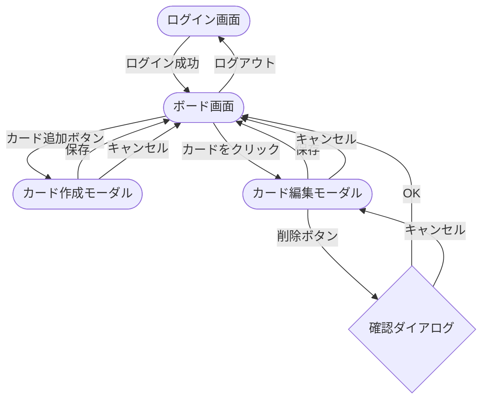
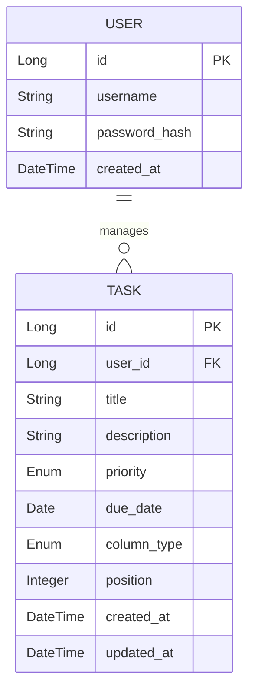

# TaskManagement - 要件定義書

## プロジェクト概要

Trello風のタスク管理アプリ。個人利用を想定し、タスクをカード形式で管理する。
カラム間のドラッグ＆ドロップでタスクの進捗を視覚的に管理できる。

---

## スコープ

### 対象範囲（In Scope）

- 単一ユーザーによるタスク管理
- カードの作成・編集・削除・移動
- 3カラム（Todo / In Progress / Done）での進捗管理
- ログイン認証

### 対象外（Out of Scope）

| 機能 | 理由 |
|------|------|
| 複数ユーザー管理・共有 | 個人利用のみを想定 |
| カラムのカスタマイズ | 固定3列で十分 |
| ファイル・画像の添付 | 対象外 |
| 通知機能（メール・プッシュ） | 対象外 |
| タスクの検索・フィルタリング | 対象外 |
| モバイルアプリ（iOS / Android） | Webのみ対応 |
| オフライン対応 | 対象外 |

---

## ユースケース一覧

| ID | ユースケース | 説明 |
|----|------------|------|
| UC01 | ログイン | ID・パスワードを入力してボード画面へアクセスする |
| UC02 | ログアウト | セッションを終了してログイン画面へ戻る |
| UC03 | タスク一覧表示 | ボード画面で全カラムのタスクを一覧表示する |
| UC04 | タスク作成 | タイトル・説明・優先度・期限を入力してタスクを追加する |
| UC05 | タスク編集 | 既存タスクの内容を変更して保存する |
| UC06 | タスク削除 | 確認ダイアログを経てタスクを削除する |
| UC07 | タスク移動 | ドラッグ＆ドロップでタスクを別カラムへ移動する |

---

## 機能要件

### 認証

| 機能 | 説明 |
|------|------|
| ログイン | 登録済みのID・パスワードで認証 |
| ログアウト | セッションを破棄してログイン画面へ遷移 |

- ユーザーは1名のみ（シングルユーザー）
- 未認証状態でボード画面へアクセスした場合、ログイン画面へリダイレクト

### カード（タスク）

| 機能 | 説明 |
|------|------|
| 作成 | タイトル・説明文・優先度・期限を入力してカードを追加 |
| 編集 | 既存カードのすべての項目を編集 |
| 削除 | 確認ダイアログを表示してカードを削除 |
| 移動 | ドラッグ＆ドロップでカラム間を移動 |

### カラム

| 機能 | 説明 |
|------|------|
| 固定表示 | Todo / In Progress / Done の3列を表示 |

### データ保存

- ブラウザを閉じてもデータが消えない
- バックエンド（Java）経由でデータベースに保存

---

## 非機能要件

### パフォーマンス

| 項目 | 基準 |
|------|------|
| 初期表示 | ボード画面の初期ロードは3秒以内 |
| 操作レスポンス | カード作成・更新・削除のAPI応答は1秒以内 |

### 対応環境

| 項目 | 内容 |
|------|------|
| 対応ブラウザ | Google Chrome 最新版 |
| 対応デバイス | PCのみ（モバイル・タブレット非対応） |
| ネットワーク | オンライン環境必須 |

### セキュリティ

| 項目 | 対応方針 |
|------|---------|
| 通信 | HTTPS対応（デプロイ時） |
| SQLインジェクション | JPA / プリペアドステートメントにより防止 |
| 認証 | 未ログイン時はボード画面へのアクセス不可 |
| パスワード | ハッシュ化して保存（BCrypt） |

---

## 画面一覧

### ログイン画面

- ID入力フィールド
- パスワード入力フィールド
- ログインボタン

### ボード画面（メイン画面）

- 3列のカラムを横並びで表示
- 各カラムにタスクカードを一覧表示
- カード追加ボタン（各カラムに配置）
- カードのドラッグ＆ドロップによるカラム間移動
- ログアウトボタン

### カード作成モーダル

- タイトル（テキスト入力）
- 説明文（テキストエリア）
- 優先度（高 / 中 / 低 から選択）
- 期限（日付選択）
- 保存ボタン / キャンセルボタン

### カード編集モーダル

- 作成モーダルと同じ項目を編集可能
- 削除ボタンを配置

---

## 画面レイアウト

### ログイン画面

```
┌──────────────────────────────────────┐
│                                      │
│           TaskManagement             │
│                                      │
│       ┌──────────────────────┐       │
│       │ ユーザーID            │       │
│       └──────────────────────┘       │
│       ┌──────────────────────┐       │
│       │ パスワード            │       │
│       └──────────────────────┘       │
│                                      │
│       ┌──────────────────────┐       │
│       │        ログイン       │       │
│       └──────────────────────┘       │
│                                      │
└──────────────────────────────────────┘
```

### ボード画面

```
┌──────────────────────────────────────────────────────┐
│  TaskManagement                        [ログアウト]  │
├──────────────────┬───────────────────┬───────────────┤
│       Todo       │    In Progress    │     Done      │
│                  │                   │               │
│  ┌────────────┐  │  ┌─────────────┐  │               │
│  │ タスクA    │  │  │ タスクB     │  │               │
│  │ 高 | 5/1   │  │  │ 中  | 5/3   │  │               │
│  └────────────┘  │  └─────────────┘  │               │
│                  │                   │               │
│   [+ 追加]       │   [+ 追加]        │   [+ 追加]    │
└──────────────────┴───────────────────┴───────────────┘
```

### カード作成 / 編集モーダル

```
┌──────────────────────────────────────────────────────┐
│  TaskManagement                        [ログアウト]  │
│  ┌────────────────────────────────────────────────┐  │
│  │           タスク作成 / 編集                    │  │
│  │                                                │  │
│  │  タイトル                                      │  │
│  │  ┌──────────────────────────────────────────┐  │  │
│  │  │                                          │  │  │
│  │  └──────────────────────────────────────────┘  │  │
│  │                                                │  │
│  │  説明文                                        │  │
│  │  ┌──────────────────────────────────────────┐  │  │
│  │  │                                          │  │  │
│  │  │                                          │  │  │
│  │  └──────────────────────────────────────────┘  │  │
│  │                                                │  │
│  │  優先度 [高 ▼]       期限 [2025/05/01]         │  │
│  │                                                │  │
│  │  [削除]           [キャンセル]  [保存]          │  │
│  └────────────────────────────────────────────────┘  │
└──────────────────────────────────────────────────────┘
```

---

## 画面遷移図



- ドラッグ＆ドロップはボード画面内のインライン操作（画面遷移なし）

---

## 技術スタック

| 項目 | 技術 |
|------|------|
| フロントエンド | Next.js / React / Tailwind CSS |
| バックエンド | Java / Spring Boot |
| データベース | PostgreSQL |
| フロント・バック間通信 | REST API |

---

## データ構造

### ユーザー（User）

| フィールド | 型 | 説明 |
|---|---|---|
| id | Long | 一意のID |
| username | String | ログインID |
| passwordHash | String | ハッシュ化されたパスワード |
| createdAt | DateTime | 作成日時 |

### カード（Task）

| フィールド | 型 | 説明 |
|---|---|---|
| id | Long | 一意のID |
| userId | Long | 所有ユーザーのID（外部キー） |
| title | String | タイトル |
| description | String | 説明文 |
| priority | Enum | HIGH / MEDIUM / LOW |
| dueDate | Date | 期限 |
| columnType | Enum | TODO / IN_PROGRESS / DONE |
| position | Integer | カラム内の並び順 |
| createdAt | DateTime | 作成日時 |
| updatedAt | DateTime | 更新日時 |

---

## ER図



- `USER` 1人に対して `TASK` は0件以上（1対多）
- 現在はシングルユーザー想定のため、USERレコードは1件のみ運用

---

## REST API 設計

### 認証

| メソッド | エンドポイント | 説明 |
|----------|--------------|------|
| POST | /api/auth/login | ログイン |
| POST | /api/auth/logout | ログアウト |

### タスク

| メソッド | エンドポイント | 説明 |
|----------|--------------|------|
| GET | /api/tasks | タスク一覧取得 |
| POST | /api/tasks | タスク作成 |
| PUT | /api/tasks/{id} | タスク更新（編集・移動） |
| DELETE | /api/tasks/{id} | タスク削除 |
