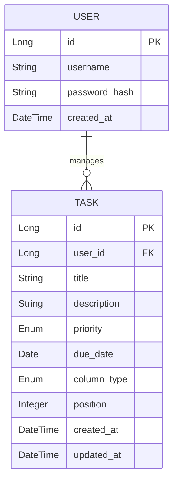

# ER図

```mermaid
erDiagram
    USER {
        Long id PK
        String username
        String password_hash
        DateTime created_at
    }
    TASK {
        Long id PK
        Long user_id FK
        String title
        String description
        Enum priority
        Date due_date
        Enum column_type
        Integer position
        DateTime created_at
        DateTime updated_at
    }
    USER ||--o{ TASK : "manages"
```

## リレーション

| 関係 | 説明 |
|------|------|
| USER → TASK | 1対多（1ユーザーに対してタスクは0件以上） |

- 現在はシングルユーザー想定のため、USERレコードは1件のみ運用
