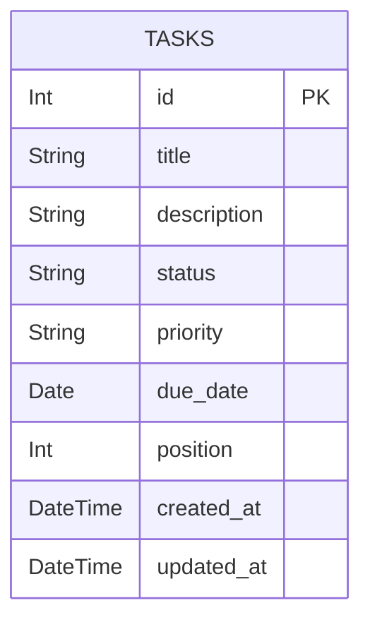
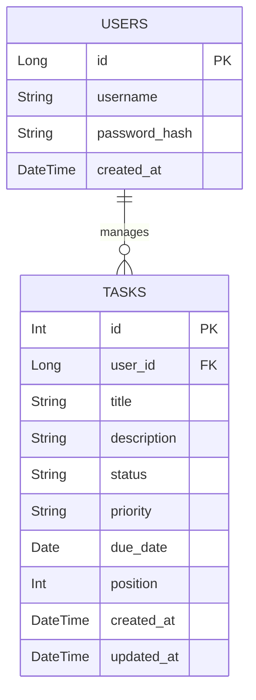

# ER図

```mermaid
erDiagram
    TASKS {
        Int id PK
        String title
        String description
        String status
        String priority
        Date due_date
        Int position
        DateTime created_at
        DateTime updated_at
    }
```

現在は認証機能未実装のため、単一の `tasks` テーブルのみが存在する。

---

## 将来のリレーション（認証機能実装時）

認証機能の実装時に `users` テーブルを追加し、以下のリレーションを設定する予定。

```mermaid
erDiagram
    USERS {
        Long id PK
        String username
        String password_hash
        DateTime created_at
    }
    TASKS {
        Int id PK
        Long user_id FK
        String title
        String description
        String status
        String priority
        Date due_date
        Int position
        DateTime created_at
        DateTime updated_at
    }
    USERS ||--o{ TASKS : "manages"
```

| 関係 | 説明 |
|------|------|
| USERS → TASKS | 1対多（1ユーザーに対してタスクは0件以上） |
