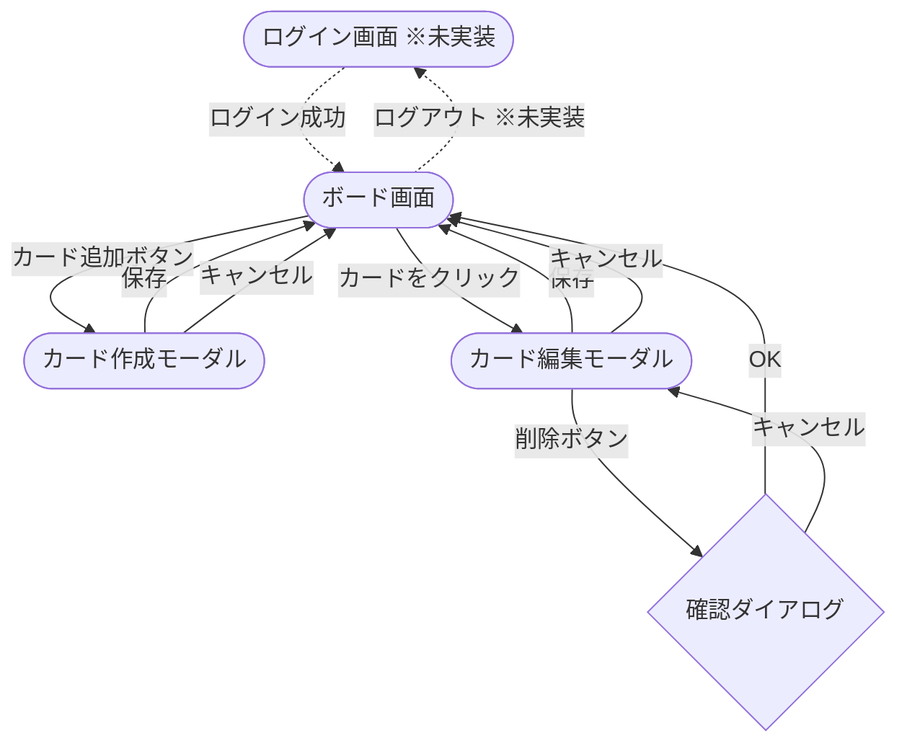

# 画面設計

## 画面一覧

| 画面名 | 説明 | 実装状況 |
|--------|------|---------|
| ボード画面 | タスクをカラム別に一覧表示するメイン画面 | ✅ 実装済み |
| カード作成モーダル | 新規タスクを入力して作成する | ✅ 実装済み |
| カード編集モーダル | 既存タスクを編集・削除する | ✅ 実装済み |
| ログイン画面 | ID・パスワードを入力して認証する | ❌ 未実装（認証機能実装時に追加予定） |

---

## 画面レイアウト

### ログイン画面（未実装 — 認証機能実装時に追加予定）

```
┌──────────────────────────────────────┐
│                                      │
│           TaskManagement             │
│                                      │
│       ┌──────────────────────┐       │
│       │ ユーザーID            │       │
│       └──────────────────────┘       │
│       ┌──────────────────────┐       │
│       │ パスワード            │       │
│       └──────────────────────┘       │
│                                      │
│       ┌──────────────────────┐       │
│       │        ログイン       │       │
│       └──────────────────────┘       │
│                                      │
└──────────────────────────────────────┘
```

**構成要素**
- ID入力フィールド
- パスワード入力フィールド
- ログインボタン

---

### ボード画面

```
┌──────────────────────────────────────────────────────────┐
│  TaskManagement                     [+ タスクを追加]      │
├──────────────────────────────────────────────────────────┤
│  🔍 キーワードで検索...   [ステータス ▼]                   │
├──────────────────┬───────────────────┬───────────────────┤
│   Todo (2)       │  In Progress (1)  │    Done (2)       │
│ [優先度▲][期日▲] │ [優先度▲][期日▲] │ [優先度▲][期日▲]  │
│                  │                   │                   │
│  ┌────────────┐  │  ┌─────────────┐  │                   │
│  │ タスクA    │  │  │ タスクB     │  │                   │
│  │ 高 | 5/1   │  │  │ 中  | 5/3   │  │                   │
│  └────────────┘  │  └─────────────┘  │                   │
│                  │                   │                   │
└──────────────────┴───────────────────┴───────────────────┘
```

**構成要素**
- 3列のカラムを横並びで表示（Todo / In Progress / Done）
- 各カラムにタスクカードを一覧表示
- タスク追加ボタン（ヘッダー右端に配置）
- 検索バー（キーワード入力フィールド + ステータスフィルタードロップダウン）
- カラムヘッダーの並び替えボタン（優先度順・期限順のトグル）
- カードのドラッグ＆ドロップによるカラム間・カラム内移動
- ログアウトボタン（未実装 — 認証機能実装時に追加予定）

---

### カード作成モーダル

```
┌──────────────────────────────────────────────────────┐
│  TaskManagement               [+ タスクを追加]       │
│  ┌────────────────────────────────────────────────┐  │
│  │  タスクを追加                              [×] │  │
│  │                                                │  │
│  │  タイトル *                                    │  │
│  │  ┌──────────────────────────────────────────┐  │  │
│  │  │                                          │  │  │
│  │  └──────────────────────────────────────────┘  │  │
│  │                                                │  │
│  │  説明                                          │  │
│  │  ┌──────────────────────────────────────────┐  │  │
│  │  │                                          │  │  │
│  │  │                                          │  │  │
│  │  └──────────────────────────────────────────┘  │  │
│  │                                                │  │
│  │  ステータス                                    │  │
│  │  ┌──────────┬─────────────┬──────────────┐  │  │
│  │  │  Todo    │ In Progress │    Done      │  │  │
│  │  └──────────┴─────────────┴──────────────┘  │  │
│  │                                                │  │
│  │  優先度                                        │  │
│  │  ┌──────────┬─────────────┬──────────────┐  │  │
│  │  │    高    │      中     │      低      │  │  │
│  │  └──────────┴─────────────┴──────────────┘  │  │
│  │                                                │  │
│  │  期日 *                                        │  │
│  │  ┌──────────────────────────────────────────┐  │  │
│  │  │ yyyy/mm/dd                               │  │  │
│  │  └──────────────────────────────────────────┘  │  │
│  │                                                │  │
│  │               [キャンセル]  [登録]              │  │
│  └────────────────────────────────────────────────┘  │
└──────────────────────────────────────────────────────┘
```

**構成要素（作成時）**
- タイトル（テキスト入力、必須）
- 説明（テキストエリア、任意）
- ステータス（Todo / In Progress / Done をボタン選択、デフォルト: Todo）
- 優先度（高 / 中 / 低 をボタン選択、デフォルト: 中）
- 期日（日付選択、必須）
- 登録ボタン / キャンセルボタン

**構成要素（編集時）**
- 作成モーダルと同じ項目を編集可能
- 削除ボタンを追加配置

---

## 画面遷移図



- ドラッグ＆ドロップはボード画面内のインライン操作（画面遷移なし）
- 点線（`-.->`）は未実装の遷移を示す
