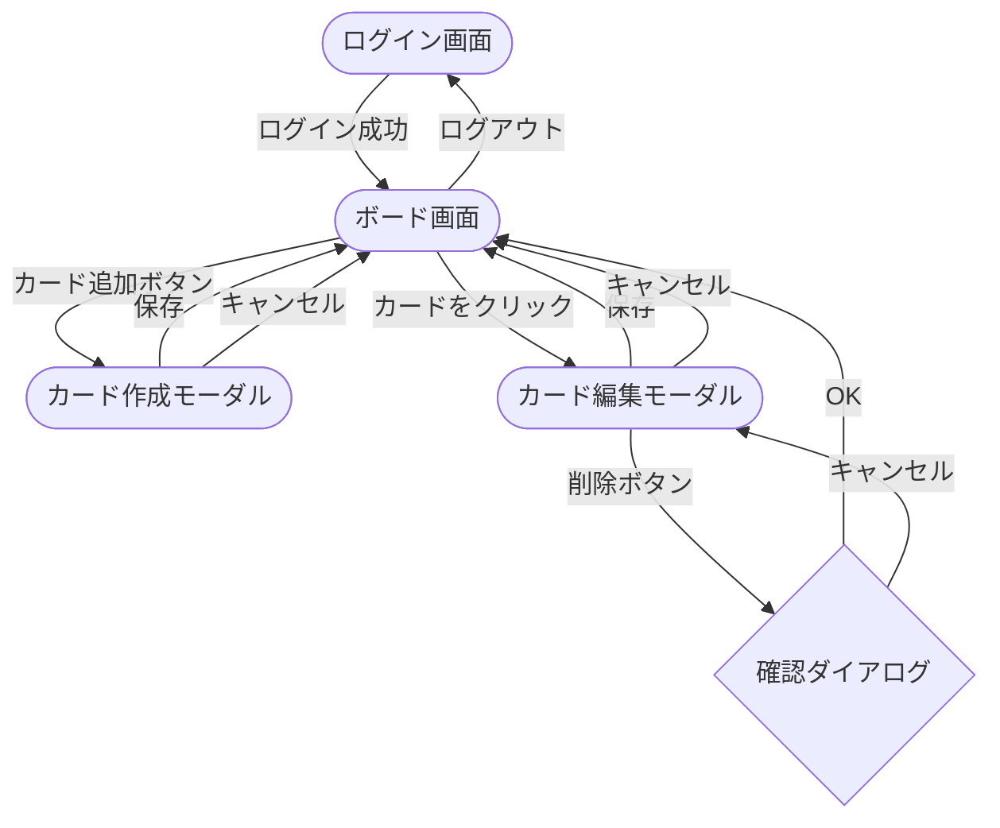

# 画面設計

## 画面一覧

| 画面名 | 説明 |
|--------|------|
| ログイン画面 | ID・パスワードを入力して認証する |
| ボード画面 | タスクをカラム別に一覧表示するメイン画面 |
| カード作成モーダル | 新規タスクを入力して作成する |
| カード編集モーダル | 既存タスクを編集・削除する |

---

## 画面レイアウト

### ログイン画面

```
┌──────────────────────────────────────┐
│                                      │
│           TaskManagement             │
│                                      │
│       ┌──────────────────────┐       │
│       │ ユーザーID            │       │
│       └──────────────────────┘       │
│       ┌──────────────────────┐       │
│       │ パスワード            │       │
│       └──────────────────────┘       │
│                                      │
│       ┌──────────────────────┐       │
│       │        ログイン       │       │
│       └──────────────────────┘       │
│                                      │
└──────────────────────────────────────┘
```

**構成要素**
- ID入力フィールド
- パスワード入力フィールド
- ログインボタン

---

### ボード画面

```
┌──────────────────────────────────────────────────────┐
│  TaskManagement                        [ログアウト]  │
├──────────────────┬───────────────────┬───────────────┤
│       Todo       │    In Progress    │     Done      │
│                  │                   │               │
│  ┌────────────┐  │  ┌─────────────┐  │               │
│  │ タスクA    │  │  │ タスクB     │  │               │
│  │ 高 | 5/1   │  │  │ 中  | 5/3   │  │               │
│  └────────────┘  │  └─────────────┘  │               │
│                  │                   │               │
│   [+ 追加]       │   [+ 追加]        │   [+ 追加]    │
└──────────────────┴───────────────────┴───────────────┘
```

**構成要素**
- 3列のカラムを横並びで表示（Todo / In Progress / Done）
- 各カラムにタスクカードを一覧表示
- カード追加ボタン（各カラムに配置）
- カードのドラッグ＆ドロップによるカラム間移動
- ログアウトボタン

---

### カード作成 / 編集モーダル

```
┌──────────────────────────────────────────────────────┐
│  TaskManagement                        [ログアウト]  │
│  ┌────────────────────────────────────────────────┐  │
│  │           タスク作成 / 編集                    │  │
│  │                                                │  │
│  │  タイトル                                      │  │
│  │  ┌──────────────────────────────────────────┐  │  │
│  │  │                                          │  │  │
│  │  └──────────────────────────────────────────┘  │  │
│  │                                                │  │
│  │  説明文                                        │  │
│  │  ┌──────────────────────────────────────────┐  │  │
│  │  │                                          │  │  │
│  │  │                                          │  │  │
│  │  └──────────────────────────────────────────┘  │  │
│  │                                                │  │
│  │  優先度 [高 ▼]       期限 [2025/05/01]         │  │
│  │                                                │  │
│  │  [削除]           [キャンセル]  [保存]          │  │
│  └────────────────────────────────────────────────┘  │
└──────────────────────────────────────────────────────┘
```

**構成要素（作成時）**
- タイトル（テキスト入力）
- 説明文（テキストエリア）
- 優先度（高 / 中 / 低 から選択）
- 期限（日付選択）
- 保存ボタン / キャンセルボタン

**構成要素（編集時）**
- 作成モーダルと同じ項目を編集可能
- 削除ボタンを追加配置

---

## 画面遷移図



- ドラッグ＆ドロップはボード画面内のインライン操作（画面遷移なし）
